# Toward a Regulatory Validation Framework for AI-Assisted Clinical Trial Activation

**Verification Architecture for Trustworthy AI in Regulated Clinical Decisions**

*The model proposes; the proof disposes.*

**Author:** Steven Thompson, Founder & CEO, NexTrial.ai · **Contact:** steven@nextrial.ai · **Date:** June 2026 · **Version:** v3.0, FDA-Filing-Aligned Revision · **Classification:** Public, Substack and GitHub Release · **Companion to:** NexTrial.ai public comment to FDA Docket No. FDA-2026-N-4390, AI-Enabled Optimization of Early-Phase Clinical Trials Pilot Program (91 FR 23100, April 29, 2026).

> **Posture.** This framework is offered as a methodology contribution under an engagement, not endorsement, posture. Nothing in it asserts or implies endorsement of NexTrial by any regulator, agency, official, standards body, or individual, nor conformance to any named standard. Regulatory and standards frameworks are cited to show design alignment, not to claim certification or agency agreement. Benefits are stated as design intent. The framework describes a methodology that is GxP-aligned, not GxP-validated; NexTrial holds no certification.

> **What changed from v2.0 to v3.0.** This revision aligns the framework to NexTrial's public comment on FDA Docket No. FDA-2026-N-4390, so that the filing and the framework read as one position. The proof certificate property numbering now matches the filing exactly, properties 1 through 8, closing the one inconsistency most likely to confuse a reader moving between the two documents. Three sections are new. A continuous-learning section (Section 5) specifies how proof binds to a system state rather than to a model, through a signed state fingerprint, bi-temporal lineage, and a predetermined change envelope, and distinguishes proof from legitimacy through the two-clocks model. A comparative-evaluation section (Section 6) distinguishes decision-level forensic comparison from trial-level statistical comparison. A section on the Real-Time Clinical Trials operational context (Section 7) is paired with GAMP 5 and Computer Software Assurance methodology alignment. The EU AI Act article mapping is made explicit (Section 8), across Articles 9, 10, 11, 12, 13, and 14. Eight concepts sharpened through public engagement with regulatory affairs, ethics, and clinical operations practitioners in mid-2026 are folded throughout: uncorrelated evidence, simulate versus prove, the Critical-to-Quality frontier placed at the design layer, provenance as the source of trust, the human-oversight platitude trap, structural boundaries rather than bolt-on filters, language precision, and jurisdiction as a first-class dimension. The central open question, who certifies that a regulation's encoding into a computable check is correct, now leads the open-questions section as the framework's principal unsolved problem. The predictive eligibility layer appears as an anonymized worked use case rather than a named product section, consistent with the framework's practice of describing systems by function.

---

## Executive Summary

Artificial intelligence systems are entering clinical trial operations at an accelerating pace. AI-assisted regulatory drafting, predictive patient-eligibility analysis, and multi-jurisdictional compliance coordination are no longer speculative; they are in deployment. The validation paradigms governing these systems, however, remain anchored in frameworks designed for diagnostic devices and software as a medical device, not for orchestration systems that draft, verify, and coordinate the documents and decisions of a clinical trial across jurisdictions, from protocol and activation paperwork through consent events and closeout.

This document proposes a validation framework whose central architectural primitive is the proof certificate: a structured artifact produced at the moment an AI-assisted decision is made. It contains eight properties.

◆ **1. Rule invoked.** The specific rule, by source, citation, and version: a regulatory provision, a protocol criterion, a standard-operating-procedure step, or a jurisdictional requirement.
◆ **2. Values verified.** The exact patient, protocol, site, or operational values checked, listed rather than summarized, attributable to source.
◆ **3. Verification operation.** The deterministic procedure that returned pass or fail on this specific decision, inspectable and reproducible.
◆ **4. Boundary statement.** What the operation did not check, and the human-judgment factors reserved for the responsible human.
◆ **5. Risk classification.** The decision's risk class, frozen at decision time, which indexes the rigor applied and the re-verification cadence.
◆ **6. Human reviewer identity.** The identity and role of the human who attested, bound to the attestation.
◆ **7. Override and escalation record.** Whether the human accepted, rejected, or asked for revision, with any override rationale and any escalation.
◆ **8. Evidence, not substitution.** An explicit declaration that the operation is evidence presented to the reviewer, not a substitution for the reviewer's independent judgment.

The artifact is reproducible, inspectable, and admissible under inspection. A confidence score is none of these things. It cannot satisfy 21 CFR Part 11 traceability, ALCOA+ data integrity, ICH E6(R3) source verification, EU AI Act Articles 11, 13, and 14, or the analogous requirements of Brazil's CFM Resolution 2.454/2026 and India's New Drugs and Clinical Trials Rules, 2019. Trustworthiness, as the NIST AI Risk Management Framework articulates it, requires architectural primitives that produce verifiable artifacts. It cannot be retrofitted. It must be designed in.

The architectural decision that determines admissibility is the separation between the layer that proposes a decision and the layer that verifies it. A probabilistic foundation model gated by deterministic verification produces inspectable artifacts; an ungated probabilistic model does not, regardless of how the surrounding documentation is constructed. The evidence the framework relies on is uncorrelated by design. A deterministic rule check, a formal structural proof, and a human attestation are three different substrates whose errors are unlikely to share a common cause. A confidence score, by contrast, is the model grading its own work; it shares the output's failure modes and is therefore correlated evidence.

Two properties extend the artifact's reach. First, a rule is a rule, regardless of its source: the same deterministic operation applies whether the rule is a regulation, a protocol provision, a procedural step, or a jurisdiction-specific requirement, so a single trustworthiness artifact spans all four without a separate evidentiary regime for each.

Second, proof binds to a system state, not to a model. A decision and its proof are fixed at a point in time: the proof attests to the exact regulation, protocol, and system state in force when the decision was made. The system keeps learning, but the proof holds for what it certified, and it must remain reconstructible and defensible after any of three things change underneath it, the regulation, the protocol, or the system itself. The framework bounds each proof within a declared context of use, the description of where and for what a given capability is trusted, and it provides a state-binding mechanism and a predetermined change envelope that keep adaptive systems auditable as they evolve. It distinguishes proof, what was true of a state at decision time, from legitimacy, what remains true as rules, protocols, and context move on. A point-in-time proof does not decay as the world changes; it holds for the state it certified, and the two-clocks model names when re-certification is required for a decision to remain defensible today. This is the framework's answer to what validation means under continuous learning, and it is developed in full in Section 5.

The 2026 Real-Time Clinical Trials trajectory makes this architectural question more urgent, not less. When inspection becomes continuous, verification must be deterministic and instantaneous. Procedural verification cannot operate at that cadence; architectural verification can. Two principles, surfaced repeatedly in co-development, organize the framework. Risk classification is the architectural primitive: the rigor at each gate, the cadence of re-verification, and the level of human attestation are all indexed to a risk class assigned and frozen at decision time. And AI verification is evidence, not substitution: the certificate is upstream evidence an inspector consumes; it does not reduce the human reviewer's burden.

The framework's posture reduces to a single contrast. Systems that simulate a regulator predict what the regulator would say, which is the definition of probably right. This framework does not simulate the regulator. It proves bounded properties deterministically and routes everything else to a named human attester. That is what provably right, not probably right, means at the property level: a defined set of structural properties proven with no probabilistic middle ground, and every remaining judgment managed by risk-based controls and accountable human attestation.

This is not a product specification. It is an architecture proposal intended for critique, refinement, and co-development with the regulatory affairs community. The recommendations specify an artifact and a schema, not an architecture. Any system that produces a conforming certificate satisfies the standard, whether or not it resembles NexTrial's.

---

## 1. Thesis: The Verification Layer Is the Admissibility Layer

The central architectural decision in any AI system deployed in regulated clinical decision-making is the relationship between the layer that proposes an output and the layer that verifies it. This decision determines whether the system's outputs are admissible under inspection, defensible in a proceeding, and compatible with the data-integrity standards that have governed electronic records since the finalization of 21 CFR Part 11.

Every regulatory framework that governs clinical AI rests on a common requirement: a regulated decision must be reconstructible, from source data through the decision logic to the rule that produced it, at the moment an inspector asks for it. The requirement appears in 21 CFR Part 11, in ALCOA+, in ICH E6(R3), in EU AI Act Articles 11, 13, and 14, in Brazil's CFM Resolution 2.454/2026, and in India's New Drugs and Clinical Trials Rules, 2019. The phrasing varies by jurisdiction. The architectural requirement does not.

Two patterns currently dominate AI deployment in clinical research. The first treats the model's output as the regulated artifact and applies a post-hoc compliance overlay to it. The second treats the model's output as a proposal that must be gated by deterministic verification before it becomes the regulated artifact. Only the second pattern is admissible under the frameworks named above, regardless of the model's accuracy, confidence, or training methodology. A compliance overlay applied after the fact documents a decision that has already been made probabilistically. A deterministic gate produces the decision as a verifiable operation in the first place.

The rule that governs the rest of this framework follows from that distinction: the model proposes; the proof disposes. The verification layer, not the model, produces the regulated artifact. A probabilistic model is admissible as a participant in the decision pipeline only because it is gated by a deterministic check it cannot bypass. Anything an inspector or an ethics board sees is produced by the deterministic verification layer, not by the probabilistic substrate that fed it.

Two properties make this layer trustworthy rather than merely present, and both recur throughout the sections that follow.

◆ **Uncorrelated evidence.** The verification gates are independent substrates that fail in different ways. A deterministic rule check can be wrong in ways a formal structural proof would catch, a structural proof can pass on a determination a human would reject, and a human can catch what neither machine operation was scoped to see. Evidence drawn from substrates that fail differently is defensible in a way that a single self-reported score is not. A confidence score offers the opposite: it is generated by the same model whose output it scores, so it inherits that output's blind spots. It is correlated evidence wearing the label of a check. Much of what is presented in clinical AI as quality control, one agent checking another agent trained on the same data, has the same defect.

◆ **Structural boundaries, not bolt-on filters.** The model in the proposing layer is constrained to non-creative, verifiable operations, so manipulation sits outside the operating envelope rather than being filtered out after the fact. A general-purpose model bolts a refusal filter onto a creative core; the creative capability remains, and the filter is a probabilistic guess about what to suppress. Constraining the operating envelope is a stronger guarantee than filtering its output. The architecture stores no documents and captures no patient data beyond what a verification operation requires, which keeps the attack surface deliberately small. Section 3 develops this boundary as the governance and anti-manipulation principle of the architecture.

The consequence is a single, durable claim. The verification layer is the admissibility layer. What makes an AI-assisted clinical decision defensible is not how confident the model was, nor how carefully the surrounding documentation was written after the fact. It is whether the decision passed through a deterministic gate that produced an inspectable artifact, and whether a named human attested to it with a clear statement of what the machine did and did not check. Section 2 places this claim in the current regulatory landscape. Section 3 builds the architecture that produces the artifact.

---

## 2. Regulatory Context: A Field Converging on One Question

The landscape moved quickly between the second version of this framework and this one. In the intervening months the United States announced a real-time clinical trials trajectory and opened the request for information this framework now accompanies, the FDA-EMA joint principles were published, and the supporting United States guidance on computer software assurance was updated. The direction of travel is consistent across jurisdictions, and it sharpens rather than softens the architectural question. This section sets out where AI in clinical trials sits today, and why a verification-architecture framework is the response the moment calls for. Instruments are cited as in force at the date of this version; regulatory texts change, and any operative system tracks the current text rather than the citation printed here.

### 2.1 The United States: from device-era guidance toward a real-time, AI-enabled trajectory

The United States baseline for data integrity in regulated records is 21 CFR Part 11, and it predates the systems now in question. The FDA's most direct statement on AI in this domain, the draft guidance Considerations for the Use of Artificial Intelligence To Support Regulatory Decision-Making for Drug and Biological Products (Docket FDA-2024-D-4689), was issued January 7, 2025 and remains a draft as of mid-2026. It is built on a seven-step, risk-based credibility assessment framework anchored on a model's Context of Use, the description of where and for what a model's output is trusted. That Context-of-Use spine maps directly onto the per-context validation tiers this framework proposes, and is adopted here as a primary organizing term. The draft guidance reserves two categories from its scope: AI used in drug discovery, and AI used for internal operational efficiency where the use does not bear on participant safety, drug quality, or the reliability of results. A deterministic verification layer that gates regulated outputs sits inside the guidance's concern, since it bears directly on the reliability of results, yet the draft does not specify how such a layer is itself validated. That is one of the gaps this framework addresses.

Two further United States instruments anchor the methodology rather than the architecture. The FDA's Computer Software Assurance guidance (Docket FDA-2022-D-0795) was finalized September 24, 2025 and updated February 3, 2026, and it establishes a risk-based, critical-thinking approach to assurance for production and quality-system software. ICH E6(R3) Good Clinical Practice, adopted by ICH in January 2025 and issued as FDA final guidance on September 9, 2025, carries the risk-based quality management and Quality-by-Design expectations that this framework places at the design layer. Both are developed further in Section 7.

The decisive recent development is operational. On April 28, 2026 the FDA announced an initiative to advance real-time clinical trials, pairing two oncology proof-of-concept trials that report endpoints and safety signals to the agency continuously with a request for information on a proposed pilot program for AI-enabled optimization of early-phase clinical trials. That request for information, Docket No. FDA-2026-N-4390, published at 91 FR 23100 (April 29, 2026) with the comment period extended by Federal Register notice posted May 27, 2026 to June 29, 2026, is the document this framework accompanies. Its significance for verification architecture is structural. When an inspector can see a decision as it is made, the distance between a decision and its inspection compresses toward zero. Procedural verification, which documents conformance after the fact, cannot operate at that cadence. Deterministic verification, which produces an inspectable artifact at the moment of the decision, can. The real-time trajectory makes the architectural question more urgent, not less.

### 2.2 The European Union: a risk-based regime and an open conformity question

The EU Artificial Intelligence Act, Regulation (EU) 2024/1689, is in force and classifies relevant clinical AI as high-risk, imposing obligations for risk management (Article 9), technical documentation (Article 11), record-keeping (Article 12), transparency (Article 13), and human oversight (Article 14). What the Act does not yet specify is how formal verification methods, mathematical proof rather than statistical estimation, map onto conformity assessment. That open question is where this framework offers a candidate answer, developed in Section 8. The FDA-EMA Guiding Principles of Good AI Practice in Drug Development, published January 2026, set out ten principles across the development lifecycle and serve as a shared external anchor; the architecture here addresses the great majority of them directly, and names the one it does not resolve as its central open question.

### 2.3 Brazil and India: jurisdiction as a first-class dimension

A framework that treats the world as one flattened regulatory surface cannot be correct in any single jurisdiction. This framework scopes requirements to jurisdiction rather than erasing the differences between them. In Brazil, trial conduct is governed by Lei nº 14.874/2024, authorization by ANVISA RDC nº 945/2024, physician oversight and accountability for AI in medical practice by CFM Resolução nº 2.454/2026 (adopted 2026, effective August 26, 2026), data protection by the LGPD (Lei nº 13.709/2018), and ethics review through the Sistema Nacional de Ética em Pesquisa com Seres Humanos (SINEP), the single-review structure established by Lei nº 14.874/2024 and its regulating Decreto nº 12.651/2025, under which a single Research Ethics Committee reviews a study under a national authority, replacing the former CEP/CONEP dual-review model. In India, the operative instrument is the New Drugs and Clinical Trials Rules, 2019, with data protection under the Digital Personal Data Protection Act, 2023, and oversight through the CDSCO. These regimes differ in substance, not only in language, and a single verification operation accommodates them by applying the jurisdiction-scoped ruleset in force, which is the subject of Section 8.

### 2.4 The validation gap, restated

Every framework named above rests on a common requirement, that a regulated decision be reconstructible from source data through the decision logic to the rule that produced it. None of them yet specifies a validation methodology for an orchestration-and-verification layer that drafts, verifies, and coordinates the regulated documents and decisions of a trial across jurisdictions, and does so while continuing to learn. The device-oriented guidances, including the Predetermined Change Control Plan concept finalized in December 2024 and the Computer Software Assurance guidance, offer portable logic for change control and risk-based assurance, but they are not a conformance home for a system that is not a device. The AI guidance offers the Context-of-Use spine and the risk-based credibility logic, but it is draft and is scoped to the credibility of a model's output rather than to the validation of the verification layer that gates it. The gap is precise: there is no settled methodology for validating the layer that produces the regulated artifact. This framework proposes one.

### 2.5 The convergence

Read together, as we read the landscape, the major authorities are circling the same question: risk-proportional validation with an accountable human in the lead. The FDA's risk-based credibility framework, the EU AI Act's risk tiers and human-oversight requirement, ICH E6(R3)'s risk-based quality management, ANVISA's and the CFM's accountability provisions, and the CDSCO's oversight structure are different expressions of one architectural demand. This framework is built toward that convergence, not against any single authority.

---

## 3. The Verification Architecture: A Risk Pre-Gate and Three Uncorrelated Gates

This section sets out the architecture that produces the proof certificate. It is one architectural choice among possible verification architectures, described here as an existence proof that a conforming artifact is buildable and runs in practice. What the framework asks of any system is the artifact, specified in Section 4, not this particular arrangement of components. A proposal flows through a risk classification pre-gate and then through three gates whose errors are unlikely to share a common cause, and emerges as a signed regulated record with a proof certificate attached.

*Figure 1. The verification pipeline. An AI-assisted proposal flows through the RBQM pre-gate, which assigns and freezes the risk class, and then through three uncorrelated gates to a signed regulated record and a proof certificate.*

### 3.0 The RBQM Pre-Gate: Risk Before Verification

Before a proposal reaches the verification gates, it passes through a risk-based quality management pre-gate. The pre-gate does not check conformance, so it is not a fourth gate. It performs a different function: it classifies the decision's risk, and that classification governs how the rest of the pipeline behaves.

The classification follows a chain the regulatory world already accepts. ICH E8(R1) Critical-to-Quality factors identify what matters in a given protocol. ICH E6(R3) risk-based quality management translates those factors into risks, key risk indicators, and quality tolerance limits. ICH Q9(R1) supplies the quality-risk-management discipline around them. The placement of this chain is the point. The pre-gate situates it at the design layer, upstream of any monitoring dashboard, because the live integrity question in AI-assisted trials is not only catching errors after they occur. It is trusting that the AI-assisted identification of what is critical in the first place was sound. That trust is established or denied at the design layer, not on a dashboard downstream of First-Patient-In, and so the pre-gate is a primary site of trustworthiness evaluation rather than an operational afterthought.

How a decision is assigned to a class follows a two-factor logic, the same two factors the FDA's draft AI guidance uses to size model risk, and the framework adopts them as the two axes of the pre-gate.

◆ **Model influence.** How much the AI-assisted output drives the decision, relative to the other evidence available to the reviewer. An output a qualified human would independently arrive at carries low influence; an output the decision effectively rests on carries high influence.
◆ **Decision consequence.** The severity of the outcome if the decision is wrong. A consequence that reaches participant safety or regulatory standing is high; a purely administrative or logistical consequence is low.

Each axis is scored high, medium, or low, and the pair places the decision into one of four classes. The mapping below is the proposed baseline; harmonizing a single taxonomy across the FDA, the EU, ANVISA, and the CDSCO is itself open work, taken up in Section 9.

| Model influence \ Decision consequence | Low | Medium | High |
| :---- | :---- | :---- | :---- |
| **High** | Moderate | High | Critical |
| **Medium** | Low | Moderate | High |
| **Low** | Low | Low | Moderate |

A high-influence, high-consequence decision is Critical and cannot be handled as anything less; a low-influence, low-consequence decision is Low. The four classes carry distinct downstream regimes, set out with the certificate in Section 4: whether evidence-only handling or any human substitution is permitted, the re-verification cadence, and the minimum level of human attestation. Critical and High decisions, for instance, prohibit substitution by construction and require the higher attestation level, while Low decisions permit lighter handling. The taxonomy is named and versioned, so that property 5 records not only the class label but the taxonomy version under which it was assigned.

The risk class the pre-gate assigns is frozen into the proof certificate at decision time, where it becomes property 5, and it parameterizes three things downstream.

◆ The rigor applied at each verification gate, scaled to the decision's risk class.
◆ The re-verification cadence, which is risk-classified rather than calendar-driven.
◆ The human re-attestation threshold under continuous learning. High-risk decisions force supersession and human re-attestation on any material change; lower-risk decisions permit wider automated variance within a predetermined change envelope, which prevents alert fatigue without lowering the floor. This is developed in Section 5.

The consequence is that risk-proportionality is structural rather than procedural. A reviewer cannot accidentally apply low-risk handling to a high-risk decision, because the risk class is assigned before verification and carried in the certificate, not selected by the reviewer after the fact.

### 3.1 Gate 1: Deterministic Compliance Verification

The first gate is a deterministic compliance foundation model: a model that applies the applicable rules, in force at the relevant snapshot version, to the named source values, and returns a determination. The term is functional. The model is deterministic and is constrained to compliance verification; it is not a frontier language model generating free text, and its determination is gated by the formal proof of Gate 2 before it is carried forward. The output is a pass-or-fail determination with citation precision sufficient for property 1 of the certificate.

The gate is rule-type-agnostic, because a rule is a rule, regardless of its source. For the purpose of a deterministic verification operation, a rule is any requirement expressible as a checkable predicate over named values, and the same operation applies across four sources.

◆ **Regulation as a rule.** A statutory or regulatory provision, cited to section and subsection.
◆ **Protocol as a rule.** A protocol provision, such as an inclusion or exclusion criterion or a dose-modification rule, cited to section and criterion.
◆ **SOP as a rule.** A standard-operating-procedure step, cited to the SOP and step.
◆ **Jurisdiction as a rule.** A jurisdiction-specific requirement, applied through the jurisdiction-scoped ruleset in force at the relevant version.

What the values are checked against is therefore not a single document but a standard of record that is itself a composite: the regulation, the protocol, the data, and the site's capability, taken together. A single trustworthiness artifact spans all four sources without a separate evidentiary regime for each, and jurisdiction is treated as a first-class dimension, scoped rather than flattened.

### 3.2 Gate 2: Structural Proof

The second gate is a formal, machine-checkable proof that verifies the structural integrity and logical form of the determination. Its operation is deterministic and reproducible, and its output is a structural-validity result, pass or fail, together with a proof artifact sufficient for property 3 of the certificate.

The honest scope of this gate is the source of its strength and the location of its hardest open question. The proof verifies structural properties: that the required elements are present, that references resolve, that no structural contradiction exists, and that defined boundaries hold for a specific output. It does not, and cannot, prove that an output is semantically correct, that the rule it applied captures what the regulation actually intends. A regulation is human-language prose that must be translated into a computable check, and the proof operates on the translation, not on the regulation. A proof can therefore be flawless while the encoding is wrong, and it will certify the encoded error with complete confidence. Gate 2 does not eliminate that risk; it concentrates it into one inspectable place, the encoding itself. This is the framework's central open question, and it is taken up directly in Section 9 rather than smoothed over here.

### 3.3 Gate 3: Human Oversight and Attestation

The third gate is a qualified human reviewer. The reviewer evaluates the proposed determination, the certificate produced by the pre-gate and Gates 1 and 2, and the boundary statement, and then accepts, rejects, or asks for revision. The final regulated decision is the human's. The certificate is evidence the reviewer consumes; it is not a decision the reviewer ratifies.

Acceptance is not the reviewer's only move, and the gate is interactive rather than a single yes or no. Because the determination arrives carrying the rule citations and the source values that Gate 1 evaluated, the reviewer's task is to verify a cited determination, not to reconstruct the analysis from source. The reviewer can accept, reject, or ask for revision, and can interrogate the determination directly: challenge how a rule was applied, question a value, or send the decision back. A rejection can drive a remediation loop in which the issue is mitigated, the verification is re-run, and the determination converges or escalates. The verdict and the exchange that produced it, including any challenge and how it was resolved, are recorded in property 7, so the record carries not only what was decided but why. That recorded reasoning is what makes the human decision defensible under a later inspection, and it is why the architecture is designed to present oversight as a verification task rather than a reconstruction task, with the human's effort spent on judgment rather than on assembling the evidence.

What the reviewer signs is specific, not generic. The attestation is bound to a defined set of reviewer obligations, the particular actions the reviewer took to discharge oversight, so that the signature is an account of what was checked rather than a checkbox. A signature that attests to nothing in particular cannot survive an inspection two years later, and the boundary statement of Section 4 is what gives the signature something to attest to. The output of this gate is a signed regulated record. The certificate is part of that record, not the record itself, and properties 6 through 8 are completed here, with the responsible principal investigator primary in the allocation of accountability.

### 3.4 Uncorrelated by Design

The three gates are uncorrelated by design, and this is the property that makes the architecture defensible rather than merely layered. A deterministic rule check, a formal structural proof, and a human attestation are three different substrates whose errors are unlikely to share a common cause. A rule check can be wrong in a way a structural proof would catch; a structural proof can pass on a determination a human would reject; a human can catch what neither machine operation was scoped to see. Evidence drawn from substrates that fail in different ways is the basis of defensible validation.

A confidence score is the opposite. It is generated by the same model whose output it scores, so it inherits that output's blind spots; it is correlated evidence wearing the label of a check. The same defect appears in any arrangement where one model checks another model trained on the same data, however the second model is labeled. Independence is not a property a system has once and keeps. Under continuous learning, substrates retrained on a common corpus can silently re-correlate, and so the independence of the gates must be actively preserved and tested over time, which Section 5 addresses as an open problem.

*Figure 2. Uncorrelated evidence. Three independent substrates, a deterministic rule check, a formal structural proof, and a human attestation, fail in different ways and converge on defensible evidence. A confidence score scores its own output and inherits its blind spots.*

### 3.5 Structural Boundaries, Not Bolt-On Filters

Governance and anti-manipulation in this architecture are structural rather than added after the fact. The model in the proposing layer is constrained to non-creative, verifiable operations, so manipulation sits outside the operating envelope to begin with, rather than being caught by a filter at the output. A general-purpose model bolts a refusal filter onto a creative core, and the creative capability remains underneath the filter; constraining the operating envelope is a stronger guarantee than filtering an unbounded output. Three named risks map to three structural controls.

◆ **Bad actors** are answered by tamper-evident, cryptographically signed lineage, written append-only, with no quiet path to alter an output after the fact. Because the signature is a FIPS-approved hash over the certificate's contents, any party can verify independently that a retained record has not been changed, without trusting the system that produced it.

◆ **Bad training and drift** are answered first by verifying every output against jurisdiction ground truth, a fixed reference that does not move when the model is retrained, so that a model which has drifted produces outputs that fail the check rather than outputs that are trusted. The ground truth is the anchor; the model is not. Beyond that, the architecture binds each output to a signed fingerprint of the exact system state that produced it, and checks the running state against the certified state continuously, so that a change to any substrate the gates depend on, the model or adapter version, the retrieval corpus, the decision thresholds, or the jurisdiction ruleset, is detected and halts use until re-certification rather than passing unnoticed. Drift is detected, not assumed absent. The full state-binding mechanism, and the harder problem of detecting when independent substrates silently re-correlate under shared retraining, are developed in Section 5.

◆ **Overconfidence and hallucination** are answered by a deterministic check rather than by model confidence. A confidence score cannot distinguish a confident correct answer from a confident wrong one, because both are produced with the same certainty; a deterministic operation can, because it tests the output against the rule and the named values rather than against the model's own estimate of itself. Nothing reaches the regulated record because the model sounded certain. A hallucinated output fails Gate 1 or Gate 2, or is caught by the human at Gate 3, and in every case the boundary statement of property 4 declares what was not checked, so that an output touching an unverified region is visible as out of scope rather than presented as verified.

The precise claim matters, because the imprecise version would be false and a regulator would be right to distrust it. The framework does not claim a model that never hallucinates, and it does not claim to eliminate drift. What the architecture provides is narrower and more defensible: a hallucinated or drifted output cannot silently become a regulated decision, because the regulated artifact is the deterministic verification output rather than the model output, and because divergence in the underlying state is detected and halts use rather than passing unnoticed. The failure modes are real and are treated as permanent conditions to be controlled, not as problems declared solved.

A further boundary keeps the attack surface deliberately small: the architecture stores no documents and captures no patient data beyond what a verification operation requires. There is less to attack, less to leak, and less to subpoena, by construction.

### 3.6 What Passes Through the Gates: Site-Triggered Verification and the Multi-Way Match

The gates verify more than the activation submission package. They verify the documents and decisions of a trial across its lifecycle, from protocol and activation paperwork through consent events and closeout, each checked at the moment it is produced rather than reconstructed afterward.

Verification is triggered by the jurisdiction of the site an output governs. An output that governs a São Paulo site is checked against the Brazilian ruleset in force for that site; an output that governs a site in India is checked against the Indian ruleset; and an output that governs sites in more than one jurisdiction is checked against each. This is what it means for jurisdiction to be a first-class dimension rather than a flattened global default, and it is why a new jurisdiction is a new scoped ruleset rather than a new platform.

What each output meets at the gate is not a one-way check against a single source but a multi-way match against the composite standard of record: the regulation, the protocol, the data, and the site's capability, each an independent source of rules, all checked together. The Context of Use bounds what the match warrants, naming where and for what a given verification is trusted, so that the certificate carries not only a result but the scope within which that result holds.

---

## 4. The Proof Certificate: Eight Properties

The proof certificate is the artifact the framework asks for. Everything in Section 3 exists to produce it, and the recommendation to a pilot or a standards body is to evaluate any system by the certificate it emits rather than by the architecture that emits it. A certificate is a machine-readable, signed, versioned object, produced at the moment an AI-assisted decision is made, and it serializes eight properties. The first four define what was checked and what was reserved for the human. The second four make the artifact defensible under inspection, under accountability scrutiny, and under continuous learning.

Each property carries an admissibility test: the specific inspection an auditor can perform against it. This is the discipline that separates a certificate from a description. A property that cannot be inspected is not a property of this certificate, and the test, not the label, is what a pilot should evaluate.

### 4.1 The eight properties and their admissibility tests

| Property | What it records | Admissibility test |
| :---- | :---- | :---- |
| **1. Rule invoked** | The specific rule, by source, citation, and version: a regulatory provision, a protocol criterion, an SOP step, or a jurisdictional requirement, with the ruleset snapshot version and effective date. Citation precision, not "applicable regulation." | An inspector re-executes the rule against the source document at the cited snapshot version and obtains the same result. |
| **2. Values verified** | The exact patient, protocol, site, or operational values checked, listed rather than summarized, each attributable to its source per ALCOA+ and contemporaneous with the decision. | Each value is independently verifiable against source, and the set is sufficient to re-execute the operation. |
| **3. Verification operation** | The deterministic procedure that returned pass or fail on this specific decision, expressible as a formal predicate, with its version and result. | An independent verifier re-running the operation against the same rule and values obtains the same output; bit-exact reproducibility is the standard. |
| **4. Boundary statement** | What the operation did not check, and the judgment factors reserved for the responsible human. Four sections, set out in 4.2. | A reviewer can determine from the boundary statement alone what the AI did and did not contribute, sufficient to apportion liability. |
| **5. Risk classification** | The risk class assigned by the RBQM pre-gate and frozen at decision time, with a named, versioned taxonomy, indexing gate rigor and re-verification cadence. | An auditor confirms the rigor and cadence applied match what the frozen risk class requires. |
| **6. Human reviewer identity** | The identity and role of the human who attested, bound to the attestation. | Liability is allocable by attestation level, with the responsible principal investigator primary. |
| **7. Override and escalation record** | Whether the human accepted, rejected, or asked for revision; any challenge the reviewer raised and how it was resolved, including any mitigate-and-rerun loop; any override and its recorded rationale; and whether escalation criteria were met and to where. | An auditor reconstructs the full human decision path, including any challenge and its resolution, and confirms escalation occurred where required. |
| **8. Evidence, not substitution** | An explicit declaration that the operation is evidence presented to the reviewer, not a substitution for the reviewer's judgment. | The certificate cannot be read as having reduced the human verification burden. |

Taken together, these properties produce an artifact that satisfies the reconstructibility requirement directly. The same object is the technical documentation EU AI Act Article 11 calls for, the basis for human oversight under Article 14, the transparency artifact under Article 13, the audit trail under 21 CFR Part 11, and the explicability artifact under CFM 2.454/2026. None of those requirements mandates a particular substrate. All of them require a particular class of artifact. A confidence score satisfies none of them.

*Figure 3. A worked proof certificate for an anonymized eligibility determination, with the eight properties populated and the four-part boundary statement. The values are illustrative; the certificate records what was checked and what was reserved, not a performance score.*

### 4.2 The boundary statement (property 4)

Property 4 is where the framework answers the most common claim made for AI oversight, that a human approved the output. A signature on its own is a platitude, not a control. The defensible question is not whether a human signed, but what the human had in front of them when they signed, and whether that record is enough for the signature to survive an inspection two years later. The boundary statement is what gives the signature something to attest to. It has four sections, and a statement missing any of them is insufficient to support effective human oversight.

◆ **Verified scope.** The bounded list of rules and criteria the operation evaluated. Anything not on the list is, by construction, outside verified scope.
◆ **Reserved scope.** The bounded list of judgment factors reserved for the human, including clinical-judgment domains, ambiguity resolution, and the interpretation of novel protocol provisions.
◆ **Reviewer obligations.** The specific actions the reviewer must take to discharge oversight, to which the signature attests, rather than a generic approval.
◆ **Escalation criteria.** The conditions under which the system must escalate to a higher level of review, and the destination of that escalation.

This is also where the certificate answers a question ALCOA+ raises but does not, on its own, resolve: what do attributable and contemporaneous mean when a model did part of the work. Attributable is satisfied because the certificate names the human who attested (property 6) and states precisely what the machine contributed and what it reserved (property 4), so the human contribution and the machine contribution are separable after the fact. Contemporaneous is satisfied because the certificate is produced at the moment of the decision rather than reconstructed later. A boundary statement is therefore not a disclaimer. It is the part of the record that makes the human's signature inspectable.

### 4.3 The risk taxonomy (property 5)

The risk class assigned at the pre-gate (Section 3.0) is carried in property 5, and it governs the regime applied to the decision. The baseline below pairs each class with its failure consequence, whether substitution is permitted, the re-verification cadence, and the minimum level of human attestation. It is a proposed baseline; harmonizing a single taxonomy across the FDA, the EU, ANVISA, and the CDSCO is open work (Section 9). Attestation Level 1 denotes a qualified reviewer; Level 2 denotes the responsible principal investigator or a delegated equivalent of equivalent standing.

| Risk class | Failure consequence | Substitution | Re-verification cadence | Minimum Gate 3 attestation |
| :---- | :---- | :---- | :---- | :---- |
| **CRITICAL** | Immediate patient-safety or regulatory risk | Prohibited by construction | Every certificate | Level 2 |
| **HIGH** | Patient-experience harm or material protocol deviation | Prohibited by construction | Daily | Level 2 |
| **MODERATE** | Operational; independent verification still required | Permitted under property 8 | Weekly | Level 1 permitted |
| **LOW** | Administrative or logistical; no safety or regulatory consequence | Permitted | At deployment, then monthly | Level 1 sufficient |

The class is not a reviewer's later judgment about how carefully to treat a decision. It is assigned before verification and frozen into the certificate, so the rigor a decision received is a matter of record rather than of discretion, and an auditor can confirm that a Critical decision was in fact treated as Critical.

### 4.4 Evidence, not substitution (property 8)

Property 8 is the certificate's load-bearing declaration, and it defaults to the conservative reading. Every certificate is evidence presented to the human unless two conditions both hold: the risk class permits substitution, and property 8 records that the substitution was authorized. Substitution is the exception, never the default, and it is unavailable by construction for Critical and High decisions. The human verification burden does not shrink because a machine did part of the work; it is relocated and made inspectable, not removed.

What makes property 8, and every other property, a control rather than an aspiration is that the architecture cannot operate without producing the certificate. A specification a system can decline to honor is a strategy, not a control. The distinction is the one a quality engineer draws between an organization that has a validation strategy and one that has a validated system: the golden evaluation set is the artifact, but the gate that runs it on every change, with no bypass path, is what makes validation real. Applied here, a certificate the system cannot emit an output without first producing is the difference between describing this discipline and being bound by it. The certificate is not retrieved on request. It is the precondition of the output.

---

## 5. Validation Under Continuous Learning: Proof Binds to a State, Not a Model

A validation framework for a system that keeps learning has to be adaptive in the same way the system is. This is the section that earlier versions of this work gestured at and did not develop, and it is the one a pilot built for real-time, adaptive AI most needs. The whole of it follows from a single principle with several consequences: proof binds to a state, not to a model.

### 5.1 The problem, stated plainly

A verification certificate establishes what was true of a specific system state at a specific time. The moment a system keeps learning after a human attests, through a model or adapter update, a changed retrieval corpus, a drifted threshold, a revised prompt or policy, or a new jurisdiction ruleset version, the deployed system diverges from the certified one. The certificate does not become wrong. It becomes stale, and it does so silently. An inspector who pulls the certificate and an inspector who pulls the live system may be looking at two different systems that share one certificate. A point-in-time proof, left alone, produces an artifact that looks complete and is no longer current. The danger is not a visible error; it is the absence of one.

### 5.2 State and the state fingerprint

A state is the full configuration the gates depend on: the model or adapter version, the retrieval corpus version, the decision thresholds, the prompt or policy version, and the jurisdiction ruleset version. A change to any of these is a new state. Each output is bound to the exact state in force when it was produced, through a signed state fingerprint, a hash of the certified configuration, recorded in a bi-temporal lineage entry that carries both valid-time, when the state was in force, and transaction-time, when the record was written.

The running state's fingerprint is checked continuously against the certified fingerprint, and a mismatch halts use until re-certification. Nothing runs uncertified, and nothing runs against a certificate that does not match it. This is the concrete meaning of the claim made in Section 3.5: drift is detected rather than assumed absent. The signed, append-only lineage that carries these fingerprints, the continuous divergence check, and the re-certification flow around it are in place and in use.

### 5.3 Each learned state re-earns its certificate

Learning does not invalidate a prior proof, and it does not require pretending the system never changes. It creates a new state, and a new state is a new object that must earn its own certificate. The prior state's certificate is superseded, not deleted, consistent with the ALCOA+ requirement that records remain enduring and available. A decision made under an earlier state stays defensible years later because that state's certificate is preserved intact. The governing values are frozen into the certificate at decision time, so an auditor reconstructing a historical decision retrieves the value that was actually applied then, not whatever a live database holds at the time of the audit. This is what preserves non-repudiation across time: the past is reconstructed against the rules and values that were actually in force, not against the present.

### 5.4 The predetermined change envelope

Re-attesting by hand on every state change does not scale, so the framework borrows and extends the logic of the FDA's Predetermined Change Control Plan concept, finalized in December 2024 for AI-enabled device software functions and cited here as a portable analog rather than a conformance claim, since the orchestration layer is not a device. The sponsor pre-specifies the bounds within which a system may learn and still be considered validated, together with the automated re-verification protocol that runs within those bounds.

◆ Learning inside the envelope is designed to trigger automated re-certification and a lineage entry, so the system can adapt without a human in the path for every change.
◆ Learning outside the envelope halts use pending human re-attestation.
◆ The certificate records whether a given modification stayed inside the authorized envelope, so the boundary itself is inspectable rather than assumed.

Re-attestation rigor is indexed to the risk class the RBQM pre-gate assigned and froze into property 5. High-risk decisions force supersession and human re-attestation on any material change; lower-risk decisions permit wider automated variance within the envelope. This is what prevents alert fatigue without lowering the floor: the floor is set by risk class, not by convenience.

A model or adapter update is the most consequential kind of state change, and it is never certified on inspection alone. A new model state must pass a full re-verification and a regression battery against a fixed evaluation set before it earns a certificate. That regression battery is a permanent floor: it runs on every model change, and risk assessment can raise the bar above it but cannot waive it, because a small change can alter behavior far from where it was made. Inside the envelope this runs as automated re-certification; a material or high-risk change runs the same battery and then halts for human re-attestation before the new state goes into use.

### 5.5 Two clocks: proof and legitimacy

Proof establishes what was true of a state at a time. It is necessary, and over time it is not sufficient. Even when a running state still matches its certificate, the rules and standards the certificate referenced can change underneath it. A certificate against a superseded ruleset can remain a valid proof against the old rules while losing legitimacy against the current ones. The framework therefore tracks two clocks for any AI-assisted decision.

◆ **State currency.** Whether the running state still matches its certificate.
◆ **Reference currency.** Whether the rules and standards the certificate referenced are still in force.

Both must hold for an output to be defensible today. This is the formal version of the point made in the executive summary, that a point-in-time proof holds for what it certified while the regulation, the protocol, and the system all move underneath it. It also reframes the human's role. The attestation is not a timestamp on a correct output. It is an ongoing posture of accountability for whether the conditions that justified the decision still hold, and an obligation to notice when they stop.

The two clocks are driven by different things, and they need different detection. State currency is driven by the system changing, and the continuous fingerprint check of Section 5.2 is what catches it. Reference currency is driven by the world changing: a regulation amended, a protocol amended, an SOP updated, a standard superseded, or a jurisdiction ruleset re-versioned. Each of these is a change to a rule in the sense of Section 3.1, where a rule may be a regulation, a protocol provision, an SOP step, or a jurisdictional requirement, so each changes the standard of record a past decision was verified against. The fingerprint check cannot catch any of them, because the system has not changed. The ground beneath it has. Reference currency therefore requires a different mechanism: continuous monitoring of the rulesets, protocol provisions, and SOPs each certificate referenced, so that when a referenced rule changes, every in-force decision that depended on it can be identified. This is the role of the regulatory-intelligence and protocol-compliance layer, and it is what turns reference currency from an assumption into a monitored clock.

A reference change does not make the original proof wrong. The certificate remains a valid proof against the rules that were in force when the decision was made, and Section 5.3 preserves it for exactly that reason. What a reference change puts in question is legitimacy: whether a decision still in execution remains compliant under the current rules. When a referenced rule moves, the change cascades through every in-force decision that depended on it, and the framework is designed to re-run those verifications automatically against the new rule. From that automatic re-verification, three things follow, in real time rather than at the next scheduled review, because in a continuous-inspection environment there is no quiet interval to wait for.

◆ **Re-classify.** The re-verification against the changed rule may move the decision into a higher risk class, which raises the rigor and the attestation level required from that point forward.
◆ **Notify.** Every in-force decision the re-verification flags as out of alignment with the current rules is surfaced, and the responsible principal investigator is alerted that the running execution may now be out of compliance.
◆ **Request re-certification at a point in time.** A re-certification under the new rule is requested, and for high-risk decisions it is forced before execution continues. The prior certificate is superseded, not deleted, so the original proof and the re-certified proof both remain in the lineage.

Re-certification triggered by a reference change is risk-indexed in the same way as re-certification triggered by a state change: high-risk decisions force human re-attestation and can halt continued execution, while lower-risk decisions are handled within the predetermined change envelope. What the right cadence is, and what evidence a regulator should expect for a reference-driven re-certification of a given risk class, is itself an open question, offered for co-development rather than asserted as settled.

A change of either kind resolves to the same cascade. A system change caught by the fingerprint, or a rule change caught by regulatory, protocol, and SOP monitoring, propagates to the decisions that depend on it, re-runs their verification, re-assesses their risk class, and surfaces recertification and principal-investigator re-attestation as it happens. This is what a real-time clinical trials environment asks for, and it is the operational subject of Section 7: not a periodic revalidation cycle run in a quiet interval, but verification intelligence that cascades in real time as the regulation, the protocol, the SOPs, and the system move.

*Figure 4. The change cascade and the two clocks. A change to the system or to a referenced rule cascades through the in-force decisions that depend on it, and a decision is defensible today only when both state currency and reference currency hold.*

### 5.6 The open problem: re-correlation under co-evolution

The gates work because their substrates fail differently. Continuous learning is precisely what can erode that. If the substrates co-evolve, for instance if a proposing model and a verifier are retrained on the same updated corpus, their failure modes can silently re-correlate, and the uncorrelated-by-design property degrades over time with no visible signal. Re-certification under learning must therefore test explicitly for re-correlation, not merely confirm that each gate still passes on its own.

Evidencing the independence of verification substrates over time is, as far as we know, an open problem. So are the related questions of how a state is best defined for divergence detection, and how a change envelope should be specified and approved. The framework does not present solutions to these and then quietly rely on them. It presents them as open, because the honest contribution at this stage is the precision of the questions rather than a claim to have closed them, and because a standard worth adopting is one whose hardest questions were named before it was set. Section 9 returns to the question that sits beneath all of these.

---

## 6. Comparative Evaluation: Statistical and Forensic Are Different Questions

How an AI-enabled trial should be compared to a non-AI baseline is two questions that are easy to merge and that require different evidence. One asks whether the AI-enabled trial produces outcomes equivalent to or better than a non-AI control. The other asks whether the AI's contribution to a specific decision is equivalent to or better than the same decision made without AI. The first is statistical. The second is forensic. The conventional comparators, historical controls, concurrent non-AI trials, and simulation studies, all answer the first. A complete evaluation framework specifies a methodology for each, because passing one does not establish the other.

### 6.1 Trial-level comparison is statistical, and existing frameworks already address it

Trial-level comparison contrasts arms, populations, and aggregate outcomes, and the established frameworks for hybrid evidence and target-trial emulation apply to it directly. It tells you the system works on average. What it cannot tell you is whether any individual decision was defensible, because aggregate equivalence can coexist with individual errors that cancel in the mean. A trial can pass at the population level while containing specific decisions that would not survive inspection, and the statistical comparator, by construction, cannot see them.

### 6.2 Decision-level comparison is forensic, and the certificate makes it feasible

Decision-level comparison asks whether one specific decision was defensible, and it is forensic rather than statistical. The proof certificate is what makes it possible. Because the certificate enumerates the exact rule invoked, the exact values, and the exact verification operation for a single decision, an independent reviewer can re-execute that operation by hand and compare the result rule by rule. Without the certificate there is nothing to re-execute, and the comparison cannot be made at all. This is the one comparator that is specific to AI-assisted decisions, and it is the comparator an inspection actually performs, because an inspection examines specific decisions, not population means. In the continuous-inspection environment of Section 7, it is also the only comparator that survives, because it does not depend on a completed dataset and a quiet interval to compute. This concordance measures defensibility on the assumption that the encoding faithfully captures the rule. Where the encoding and the human reviewer share the same misreading, concordance can be high while both are wrong, so the forensic comparator inherits the encoding-fidelity limit named in Section 9.1 rather than resolving it.

### 6.3 The split, dimension by dimension

| Dimension | Trial-level (statistical) | Decision-level (forensic) |
| :---- | :---- | :---- |
| Question | Does the AI-enabled trial perform at least as well as a non-AI control? | Is the AI's contribution to this specific decision equivalent to or better than the same decision without AI? |
| Unit of analysis | The trial: arms, population | The single decision |
| Evidence type | Statistical, aggregate | Forensic, per-decision, reconstructible |
| What it proves | Average performance | Defensibility of a specific output |
| Enabled by | Randomization, hybrid-evidence design | The proof certificate |
| Regulatory home | Hybrid evidence, target-trial emulation | Inspection, 21 CFR Part 11 reconstructibility |
| Failure visibility | Detects aggregate drift, can miss individual errors | Detects the specific error in the specific decision |

### 6.4 What each measures, and why both are needed

The trial-level comparator returns one population-level contrast and is silent on any single decision. The decision-level comparator decomposes a single decision into its constituent rules and re-executes each one independently, so that agreement is measured rule by rule and any disagreement is localized to the exact rule, value, or operation that diverged. A statistical comparator cannot localize a failure this way, because its unit of analysis is the population rather than the decision. The two are complementary, and a complete evaluation framework needs both: the statistical comparator to establish that the system works on average, the forensic comparator to establish that a given decision is defensible.

This framework proposes how AI-assisted decisions should be measured; it does not present hypothetical figures for how a particular system would score, because the numbers are produced by evaluation, not by argument. The output of the forensic comparator is rule-level concordance between an AI-assisted determination and an independent human re-execution of the same verification, and that concordance is exactly the kind of evidence a structured certificate can produce at scale, decision by decision, rather than only in aggregate at the end.

---

## 7. The Real-Time Clinical Trials Context and GxP Methodology Alignment

The 2026 real-time trajectory set out in Section 2.1 is not only a reason this framework exists. It is an operational environment with specific architectural demands, and it is the environment the continuous-learning cascade of Section 5 was built for. This section sets out what continuous inspection changes, what inspection-readiness should require, and how the methodology aligns with the assurance frameworks that govern GxP computerized systems.

### 7.1 What continuous inspection changes

When a regulator can see trial data in real time, the buffer for analysis and contextualization narrows, and inspection moves from periodic toward continuous. That single change carries a direct architectural consequence. Statistical aggregate metrics, computed over a completed dataset in a quiet interval, do not survive continuous inspection, because the quiet interval is exactly what disappears. Per-decision verification artifacts do survive, because each one is complete at the moment its decision is made. This is the same distinction Section 6 draws between the statistical and the forensic comparator, seen from the operational side: the forensic comparator is the one that survives, because it does not wait for a completed dataset.

The net effect of the real-time trajectory is to compress the distance between a decision and its inspection toward zero. Proof certificates and deterministic verification are therefore not forward-looking conveniences in a real-time environment. They are operational necessities. An architecture that produces an inspectable, reproducible, human-attested artifact at the moment of decision is built for that world. An architecture that assembles its evidence after the fact is not.

### 7.2 Inspection-readiness recommendations

◆ **Retrievable on demand, not only at scheduled events.** A proof certificate should be retrievable within a defined wall-clock interval at any point during the trial. Three seconds from query to delivery is a reasonable working baseline, achievable on standard cloud-database infrastructure and consistent with the cadence continuous inspection requires.
◆ **Retrieval performance is a trustworthiness metric, not an operational footnote.** In a continuous-inspection environment, an artifact that cannot be produced on demand is not meaningfully available, regardless of its quality, so inspection-time retrieval belongs among the primary criteria a pilot evaluates.
◆ **The continuous-learning mechanisms are what keep an adaptive system inspectable here.** State binding, the predetermined change envelope, and the two-clock model of Section 5 are the means by which a system that keeps learning can still answer, in real time, which certified state produced a given output and whether that state and the rules it referenced remain current.
◆ **Calibrate the external bar to the internal one.** Where the Agency sets a high architectural standard in its own use of AI, including strong security controls and explicit human verification at each stage, the bar applied to external AI in the pilot is best calibrated to a comparable standard, so the bar for participants matches the bar the Agency applies to itself.

### 7.3 GxP methodology alignment: GAMP 5 and Computer Software Assurance

The methodology aligns with the risk-based, Quality-by-Design approach of GAMP 5 (Second Edition, ISPE, 2022) and with the risk-based critical thinking of the FDA's Computer Software Assurance guidance, finalized September 24, 2025 and updated February 3, 2026. The alignment is substantive, not nominal, and it falls out of the architecture rather than being added on top of it.

Computer Software Assurance turns on two ideas: scale assurance effort to risk, and favor critical thinking over uniform scripted testing. The framework operationalizes both at the RBQM pre-gate. Because rigor, re-verification cadence, and attestation level are indexed to a risk class that is assigned before verification and frozen into property 5, assurance is proportionate by construction rather than uniform by default, and the effort spent on a decision is a recorded function of its risk rather than a matter of after-the-fact discretion. A system of the kind described here, a custom application performing GxP-relevant functions, sits at GAMP Category 5, where validation rigor is highest. The determinism and regression battery of Section 5.4, a fixed evaluation set run on every change with no bypass, is that rigor made operational, and it is the same discipline as the distinction in Section 4.4 between a validation strategy and a validated system.

A precise word on posture, because the language matters and the claim is easy to overstate. The methodology is GxP-aligned, not GxP-validated. NexTrial holds no certification. Regulatory and standards frameworks are cited to show design alignment, never to claim conformance to a named standard or agreement from any authority. Where this framework references device-oriented guidances, the Predetermined Change Control Plan concept and the production-and-quality-system scope of Computer Software Assurance, it cites them for portable principles, since the orchestration and verification layer is not a medical device, not software as a medical device, and not software in a medical device. The framework describes an AI platform built for regulated use, and a methodology that aligns with the GxP assurance frameworks, and it claims neither more nor less than that.

---

## 8. Jurisdictional Architecture and the EU AI Act

A framework that treats the world as one flattened regulatory surface cannot be correct in any single jurisdiction. This one treats jurisdiction as a first-class dimension, and the architecture of Section 3 is what makes that practical rather than aspirational. This section sets out how jurisdiction is scoped, how the EU AI Act maps onto the architecture article by article, how validation tiers track context of use, and why provenance, not data readiness, is where trust is located.

### 8.1 Jurisdiction as a first-class dimension

Verification is triggered by the jurisdiction of the site an output governs (Section 3.6), and a rule is a rule whatever jurisdiction issues it (Section 3.1). The consequence is that a new jurisdiction is a new scoped ruleset, not a new platform. The same verification operation runs against the United States ruleset and the Brazil ruleset, each independently versioned, and the same eligibility or conformance decision yields two certificates that share one schema and differ only in the jurisdiction-scoped rules invoked and the snapshot versions frozen into properties 1 and 5. Nothing in the artifact is rebuilt per market; only the ruleset and the snapshot change.

This is what makes regulatory reliance practical rather than rhetorical, and Brazil has built the pathway. Under ANVISA RDC 945/2024 and Normative Instruction 338/2024, an optimized analysis procedure based on regulatory reliance lets ANVISA rely on the assessment of an Equivalent Foreign Regulatory Authority rather than duplicate it. Reliance in practice depends on whether one authority's assessment travels in a form another can examine at the level of the specific decision. A portable, architecture-neutral proof certificate is that form. Where a United States assessment qualifies under that procedure, a United States-scoped certificate and an ANVISA-scoped certificate built on a common schema let a Brazilian reviewer build on the determination rather than re-derive it. The artifact is designed to feed a reliance pathway ANVISA has already operationalized. Regulatory reliance is, in this sense, the policy cousin of treating jurisdiction as a rule: the same architecture that scopes verification to a site is what lets one authority's decision travel to another.

### 8.2 The EU AI Act, article by article

The EU AI Act classifies relevant clinical AI as high-risk and imposes obligations that map onto the architecture directly. The mapping is concrete, and in each case the artifact the article requires is one the architecture already produces.

◆ **Article 9, risk management.** The RBQM pre-gate is a documented, continuously maintained classification of risk for every output the system produces, bounded by a declared context of use. That is the structural form of an Article 9 risk-management system.
◆ **Article 10, data governance.** Processing and residency are scoped by jurisdiction, with data and processing kept in-region, including LGPD compliance for the Brazil-scoped perimeter, and de-identification applied to each jurisdiction's standard. Residency is a property of the deployment, not a clause in a policy.
◆ **Articles 11 and 12, technical documentation and record-keeping.** The proof certificate is the technical documentation Article 11 calls for, and the signed, append-only, supersede-not-delete lineage of Section 5 is the record-keeping Article 12 requires.
◆ **Article 13, transparency.** A single certificate projects to each stakeholder at the level of detail that stakeholder needs, so transparency is served without exposing more than each role requires.
◆ **Article 14, human oversight.** Gate 3 and the boundary statement are effective human oversight made inspectable: a named human attests, against a record of exactly what was and was not checked.

What the Act does not yet specify is how formal verification methods map onto conformity assessment. The structural proof of Gate 2 is offered as a candidate answer to that open question, not as a settled one.

### 8.3 Validation tiers and context of use

Context of use is the term that connects risk classification to jurisdiction. A capability is not validated in the abstract; it is validated for a particular context of use, the description of where and for what it is trusted, and the validation tier required scales with the stakes of that context. A low-stakes context of use carries a lighter tier; the highest-stakes contexts, including predictive analysis bearing on eligibility, carry the most demanding tier and the tightest human-oversight requirements. This is the same risk-proportionality the pre-gate applies to a single decision (Section 3.0), lifted to the level of a capability and its declared context. It is also how the framework's per-context tiers line up with the way regulators are increasingly framing AI maturity: maturity and context of use are two names for the same axis, the degree of validation a capability has earned for the use it is put to.

### 8.4 Provenance is trust: the bi-temporal lineage

Provenance, not data readiness, is where trust is located, and in this framework provenance is a concrete mechanism rather than a claim. AI-ready data is an input. Provenance is the record of where every value a decision relied on came from, when, under which system state, against which rule, and who attested, retained in a form an inspector can reconstruct. That record is the bi-temporal lineage, and it is worth setting out in detail, because it is what the rest of the framework rests on.

**Two axes of time.** Every entry in the lineage carries two timestamps, not one. Valid-time records when a fact was true, or when a state was in force, in the world. Transaction-time records when the entry was written to the store. A single-timeline log conflates the two and cannot distinguish a value that was recorded at the time from one inserted or corrected later. Two axes separate them, and that separation is what lets the lineage answer an as-of query: reconstruct a decision exactly as it stood at the moment it was made, against the values and rules in force then, regardless of what the live system holds at the time of the audit. This is the technical basis for the non-repudiation across time described in Section 5.3.

**The provenance chain for a single value.** For any value a decision relied on, property 2 records its source origin, its acquisition timestamp, and its attribution chain. The lineage then binds that value to the signed state fingerprint of the configuration that produced the decision (Section 5.2), to the rule snapshot invoked (property 1), and to the human who attested (property 6). The result is a chain, not a field: value, to source, to state, to rule, to attester, each link retrievable and each anchored in time on both axes. Provenance is the ability to walk that chain for any decision, on demand, and to have every step return what was actually in force rather than what is current.

**Append-only, signed, supersede-not-delete.** Entries are never overwritten. A correction is a new entry at a new transaction-time, so the prior value remains in the store and the change is visible as a change rather than concealed as a substitution. Because transaction-time is immutable and the store is append-only, a record cannot be back-dated without detection. Each entry is signed with a FIPS-approved hash, SHA-256 under FIPS 180-4 or HMAC-SHA-256 under FIPS 198-1, so any party, the sponsor, an auditor, or the regulator, can verify independently that a retained record has not been altered after the fact, without trusting the system that produced it.

**ALCOA+ realized, not asserted.** The bi-temporal, append-only, signed lineage is where several ALCOA+ requirements stop being policy language and become structure. Original, because supersession preserves the original rather than overwriting it. Contemporaneous, because transaction-time records when each entry was written. Enduring and available, because retention is append-only and the record is retrievable on demand. Attributable, because every value is bound to its source and every attestation to a named human, which is the operational meaning of attributable when a model did part of the work: the human contribution and the machine contribution stay separable after the fact. A confidence score carries none of this. Provenance is a property of the lineage, demonstrated by walking the chain, not a quality asserted about the data.

---

## 9. Open Questions and an Invitation to Co-Development

This framework proposes an architecture. It does not claim to have answered every question that architecture raises, and the most important section of a framework offered for co-development is the one that states honestly what it has not closed. The questions below are where co-authorship lives, and the first is the one the framework most wants help with.

### 9.1 The central open question: who certifies the encoding

A regulation is human-language prose. A verification operation is a computable check. Between them sits a translation, and that translation is where the hardest question lives: when a regulation is encoded into a computable check, who certifies that the encoding is faithful, and who is accountable when the check is structurally perfect and semantically wrong. A proof can be flawless and still certify an error, because the proof operates on the encoding, not on the regulation the encoding was meant to capture. The risk takes three forms.

◆ **A threshold drifts from intent.** The encoded number stops matching what the regulation meant, while the check continues to pass.
◆ **Rules that are correct in isolation interact wrongly.** Each encoded check is right on its own, and together they produce a determination none of them intended.
◆ **An encoding is outdated or jurisdictionally mismatched.** The rule has moved, or the wrong jurisdiction's encoding has been applied, and nothing in the structure reveals it.

Gate 2 does not eliminate this risk, and the framework does not claim it does. What Gate 2 does is concentrate the risk into one inspectable place, the encoding itself, rather than diffusing it through a probabilistic system where it cannot be found. That concentration is the contribution. The encoding becomes the object certification effort should focus on, and the framework treats it as the trust instrument, offered as the principal unsolved problem rather than smoothed over. A standard worth adopting is one whose hardest question was named before it was set.

One candidate answer addresses part of the question. The proof certificate can be bound to an already-adopted data standard rather than introduced as a new format: represented as a native extension of the Unified Study Definitions Model, carried on a USDM ExtensionClass, so the certificate attaches directly to the clinical element it governs and is expressed in a representation regulators already consume. Because that standard is already adopted across multiple authorities, machine-interpretability across jurisdictions becomes a consequence of the binding rather than a separate problem to solve. This addresses interpretability and binding. It does not by itself certify that the encoding captured the regulation's intent, which is the harder half of the question and remains open. This pathway was contributed by Jessica Stuyvenberg (Stuyvenberg Advisory Group), drawing on the ARCH Framework (working paper, 2026, Creative Commons Attribution 4.0), as one proposal among several.

The continuous-learning problems raised in Section 5 are versions of this same question seen over time. How to evidence that verification substrates remain independent as they co-evolve, how a system state is best defined for divergence detection, how a change envelope should be specified and approved, and what cadence and evidence a reference-driven re-certification should require, are all forms of one underlying question: who certifies that the computable representation still faithfully tracks the regulatory and clinical reality it stands for, and that it has not silently drifted from it.

### 9.2 Cross-agency proof-certificate standardization

The certificate schema in this framework is eight properties. The open work is cross-agency standardization: what minimum property set regulators, beginning with the FDA, the EU, ANVISA, and the CDSCO, and extending to any agency willing to participate, would agree to accept, and how a certificate should be presented to a reviewer without formal-methods expertise. More than one multi-property schema now exists in the field, and identifying a common interoperability pathway among them, including at the data-representation layer where clinical trial data standards live, is a standardization question, not a settled one.

### 9.3 Risk taxonomy harmonization

The four-class taxonomy in Section 4.3 is a proposed baseline. A shared taxonomy across the FDA, the EU, ANVISA, and the CDSCO is the foundation the entire cross-jurisdictional structure rests on, because if risk classification is the architectural primitive, a harmonized taxonomy is what every jurisdiction's rigor and cadence would index to. It does not yet exist. What process should produce it, and which body should convene that process, is open.

### 9.4 Patient equity at the architectural layer

For predictive analysis bearing on eligibility, the procedural layer is addressable through escalation and the boundary statement. The architectural layer is harder: whether a demographic-accuracy disparity should be handled by disclosing it, by defining formal bias boundaries around it, a verifiable boundary that no protected attribute exerted undue influence on a specific prediction beyond clinically justified thresholds, or, if the disparity proves structured rather than random, by a conditional combination decided in advance. Where those thresholds are drawn should be co-developed with regulatory affairs, bioethics review, and patient-community engagement. This is the question most in need of biostatistical and fairness-research input.

### 9.5 Cross-jurisdictional mutual recognition

The reliance pathway in Section 8.1 shows that the mechanism exists in at least one corridor, where one authority can rely on another's assessment rather than duplicate it. Practitioners have rated broader cross-jurisdictional acceptance as plausible within a few years, conditional on a shared framework, while identifying standardization itself as the single biggest barrier. The open question is concrete: what standardization steps move mutual recognition from plausible-in-principle to operational-in-practice, and which body convenes them.

### 9.6 Escalation enforcement and arbitration

Property 7 records escalation, and a real-time service-level agreement is one mechanism for enforcing it. Making that real raises questions the framework does not resolve: who arbitrates a breach when a sponsor and a site disagree on whether the agreement was met, and what aggregate signal, how many breaches, of what severity, over what window, should rise from a private contractual matter to one that warrants regulatory attention.

### 9.7 Mapping to the Predetermined Change Control Plan

The Predetermined Change Control Plan framework governs change to AI-enabled device software functions. How proof certificates should map onto it is open: when a model or adapter is updated, what proof-certificate evidence the plan should require from the prior and the updated state, and how the change's risk class determines that requirement. Section 5.4 proposes the envelope-and-regression structure; its formal mapping to the plan is co-development work.

---

## 10. Conclusion

This framework exists because the field does not yet have one. AI systems are entering clinical trial operations faster than the infrastructure built to validate them, and the gap is not speculative. Systems that draft regulatory documents, analyze patient eligibility, and coordinate multi-jurisdictional compliance are already in deployment, validated against paradigms built for diagnostic devices rather than for orchestration.

The conviction beneath the architecture is specific. AI in regulated clinical environments needs validation that goes beyond statistical accuracy to deterministic, auditable, reconstructible evidence. Statistical validation asks how often a system is correct. Verification asks whether a specific output can be shown to have respected its constraints, reconstructed at the moment an inspector asks. Both questions matter, and the second has not been adequately addressed.

What this version adds to the prior ones is the part that makes the architecture honest about time. Proof binds to a state, not to a model. A system that keeps learning stays auditable through state binding, a predetermined change envelope, and the distinction between proof and legitimacy. The comparison that survives continuous inspection is forensic and per-decision, not statistical and aggregate. And the hardest question, who certifies that a regulation's encoding is faithful, is named as the framework's lead open problem rather than buried.

The posture reduces to a few lines that hold across the whole document. The model proposes; the proof disposes. Others simulate the regulator; this framework proves bounded properties and routes the rest to an accountable human. Provably right, not probably right. This remains an invitation rather than a conclusion, offered for critique and co-development, and offered in the spirit of engagement rather than any claim of endorsement.

---

## Appendix A. Regulatory Reference by Jurisdiction

This appendix gives the fuller citation set the deterministic compliance verification layer encodes for each jurisdiction. Verification is always triggered by the jurisdiction of the site an output governs (Sections 3.6 and 8); these lists describe the requirement surface a given jurisdiction-scoped ruleset draws on, not a checklist applied universally. All instruments are cited as adopted and in force as of June 2026, except where a later effective date is noted; regulatory instruments change, and the operative ruleset tracks the current text rather than the citation printed here.

**United States (FDA).** Title 21 of the Code of Federal Regulations, including Part 11 (electronic records and electronic signatures), Part 50 (protection of human subjects and informed consent), Part 54 (financial disclosure by clinical investigators), Part 56 (institutional review boards), Part 312 (investigational new drug application), Part 314 (applications for marketing approval of a new drug), and Part 601 (licensing of biologics); ICH E6(R3) Good Clinical Practice (FDA final guidance, September 9, 2025); ICH E8(R1) general considerations for clinical studies; ICH Q9(R1) quality risk management; the FDA Computer Software Assurance guidance (finalized September 24, 2025; updated February 3, 2026); the Predetermined Change Control Plan framework for AI-enabled device software functions (final, December 2024); the draft guidance Considerations for the Use of Artificial Intelligence To Support Regulatory Decision-Making for Drug and Biological Products (Docket FDA-2024-D-4689, issued January 7, 2025, draft as of June 2026); the FDA-EMA Guiding Principles of Good AI Practice in Drug Development (January 2026); the NIST AI Risk Management Framework (AI 100-1); and the FDA Real-Time Clinical Trials initiative announced April 28, 2026, together with its Request for Information on the AI-Enabled Optimization of Early-Phase Clinical Trials Pilot Program (Docket FDA-2026-N-4390, 91 FR 23100, April 29, 2026, comment period open through June 29, 2026). Data privacy is governed by HIPAA where protected health information is in scope.

**Brazil (ANVISA and CFM).** Lei nº 14.874/2024 (the clinical research law governing trial conduct and post-trial access) and its regulating Decreto nº 12.651/2025; RDC nº 945/2024 (authorization of clinical trials for marketing purposes, which revoked and replaced RDC 9/2015 and RDC 449/2020); IN nº 338/2024 (optimized reliance-based analysis and the list of Equivalent Foreign Regulatory Authorities); RDC nº 751/2022 (medical-device risk classification and registration, as amended by RDC 777/2023 and RDC 810/2023); RDC nº 848/2024 (essential safety and performance requirements, including software-as-a-medical-device cybersecurity); Resolução CFM nº 2.454/2026 (physician oversight and accountability for AI in medical practice; effective August 26, 2026); the LGPD, Lei nº 13.709/2018 (data protection); and the Sistema Nacional de Ética em Pesquisa com Seres Humanos (SINEP), the single-review ethics structure established by Lei nº 14.874/2024 and regulated by Decreto nº 12.651/2025, under which a single Research Ethics Committee reviews a study under the national authority (INAEP), replacing the former CEP/CONEP dual-review model. Sponsor submissions are structured as the Dossiê de Desenvolvimento Clínico de Medicamento (DDCM) and the Dossiê Específico de Ensaio Clínico (DEEC).

**India (CDSCO).** The New Drugs and Clinical Trials Rules, 2019 (NDCTR 2019), promulgated under the Drugs and Cosmetics Act, 1940, which superseded Part XA and Schedule Y of the Drugs and Cosmetics Rules, 1945; the NDCTR Seventh Schedule (formula and procedure for clinical-trial-related injury or death compensation); the Indian GCP guidelines; the Digital Personal Data Protection Act, 2023 (DPDP Act); and CDSCO and Drugs Controller General of India procedural requirements, including ICMR's National Ethical Guidelines for Biomedical and Health Research where biomedical and health research is in scope.

**European Union (EMA and national competent authorities).** Regulation (EU) No 536/2014, the Clinical Trials Regulation, submitted through the Clinical Trials Information System and having replaced Directive 2001/20/EC; the General Data Protection Regulation, Regulation (EU) 2016/679, with particular weight on Articles 6 and 9 governing the processing of sensitive personal data; ICH E6(R3) Good Clinical Practice; and the EU Artificial Intelligence Act, Regulation (EU) 2024/1689, which classifies relevant healthcare AI as high-risk under Annex III and imposes obligations for risk management (Article 9), data governance (Article 10), technical documentation (Article 11), record-keeping (Article 12), transparency (Article 13), and human oversight (Article 14). National competent authorities and ethics committees conduct the country-specific assessment.

These are the jurisdictions whose rulesets the framework currently scopes. As Section 8 notes, a new jurisdiction is a new scoped ruleset, not a new platform.

---

_The NexTrial architecture reflects the work of its technical and regulatory team. Yan Barros designed the predictive eligibility layer and the protocol-extraction method behind it. Graziela Peduti leads NexTrial's global regulatory intelligence, and the multi-jurisdictional verification model, and its Brazilian foundation in particular (ANVISA, CFM 2.454/2026, Lei 14.874/2024, LGPD, SINEP), reflects her regulatory authorship._

_With thanks to the practitioners who contributed to the May 14, 2026 working session and the surrounding discussion. The risk-stratified validation approach in Sections 3.0, 4.3, and 5 reflects contributions from Gourav Pandey, Principal Manager, R&D GMP Quality (the continuous-integration-gate principle and the distinction between a validation strategy and a validated system); Paul Hanson (change-control practice and validation commensurate to patient risk); Jim Taylor (scoping re-test rigor to the risk assessment itself); and Thane Carson (mandatory regression testing as a permanent floor). Michelle Purdom, PhD, contributed review and feedback that shaped the framework across its development, from the v0.1 draft through the working session and the revisions that followed. Bindiya Bhanushali, CRC, contributed the site- and coordinator-level perspective continuously over the past year. Jessica Stuyvenberg (Stuyvenberg Advisory Group) contributed the USDM-extension binding pathway discussed under the central open question (Section 9.1), the mechanism by which a proof certificate binds natively to the object-level identifier of the clinical element it governs, making cross-jurisdictional interpretability a consequence of binding to an adopted standard rather than a separate problem to solve. Contributions are individual; acknowledgment reflects participation in the work and does not imply institutional endorsement._

_Correspondence: Steven Thompson, Founder & CEO, NexTrial.ai, steven@nextrial.ai_

_Version 3.0, FDA-Filing-Aligned Revision. Released for public review via Substack and GitHub, June 2026._
